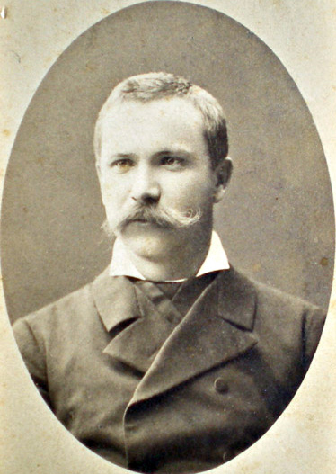

<!DOCTYPE html>
<html lang="uk">
<head>
  <meta charset="UTF-8">
  <meta name="viewport" content="width=device-width, initial-scale=1.0">
  <title>Сто тисяч — Іван Карпенко-Карий</title>
  <link href="https://fonts.googleapis.com/css2?family=Roboto:wght@400;700&display=swap" rel="stylesheet">
  
</head>
<body>
  

    <header>
      <h1>Сто тисяч</h1>
      <nav>
        Автор
        Герої
        Сюжет
        Цитата
        Проблематика
      </nav>
    </header>

    

      

        
        

          <h2>Іван Карпенко-Карий</h2>
          
<em>справжнє ім’я — Іван Тобілевич</em>

          <h3 style="color:#00796B;margin-top:10px">Роки життя</h3>
          
1845 — 1907

          
Один із найвизначніших українських драматургів, що гостро викривав соціальні пороки сучасності через сатиру та комедію.

          <h3 style="color:#1a1a1a;margin-top:10px">Інші твори</h3>
          <ul>
            <li>«Хазяїн»</li>
            <li>«Мартин Боруля»</li>
            <li>«Суєта»</li>
            <li>«Сава Чалий»</li>
            <li>«Безталанна»</li>
          </ul>
        

      

      

        <section>
          <h3>Рік написання</h3>
          
1889

        </section>

        <section>
          <h3>Герої твору</h3>
          <ul>
            <li>Герасим Калитка — селянин-багатій, жорсткий і жадібний, мріє про землю і збагачення будь-якою ціною.</li>
            <li>Параска — його дружина</li>
            <li>Роман — син Калитки.</li>
            <li>Мотря — наймичка, кохана Романа.</li>
            <li>Бонавентура — шахрай.</li>
            <li>Копач — приятель Калитки.</li>
          </ul>
        </section>

        <section>
          <h3>Сюжет</h3>
          
<strong>Експозиція</strong> Селянин Герасим Калитка мріє скуповувати землю і бачить у грошах найвищу цінність. Він фанатично переконаний, що багатство — це сила. Його родина (дружина Параска, син Роман, наймичка Мотря) не поділяє цієї одержимості, але не може вплинути на нього.

          
<strong>Зав’язка</strong> Калитці товариш радить звернутися до пройдисвіта Бонавентури, який пропонує купити сто тисяч фальшивих грошей за двадцять тисяч справжніх. Калитка вагається, але жадоба переважає — він погоджується.

          
<strong>Розвиток дії</strong> Герасим бере в борг потрібну суму, вирушає на угоду до міста. Отримавши згорток з грошима, повертається додому в ейфорії. Він переконаний, що йому вдалося обдурити світ — скоро він матиме море землі за безцінь.

          
<strong>Кульмінація</strong> Сам на сам у хліві, Калитка розгортає згорток — і бачить купу звичайного паперу. Його ошукали. Це мить повного краху — морального, матеріального, особистісного.

          
<strong>Розв’язка</strong> У шаленому відчаї Калитка намагається повіситися, але його випадково рятує слуга Савка. Наприкінці герой залишається живим, але повністю зламаним, зруйнованим не стільки вчинком шахрая, як власною жадобою.

        </section>

        <section>
          <h3>Цитата</h3>
          
Глянеш оком навколо — усе твоє: там череда пасеться, там орють на пар, а тут зазеленіла вже пшениця і колосується жито; і все то гроші, гроші, гроші…

          
Калитка після того, як прикупив ще трохи землі радіє, скільки вона принесе грошей.

        </section>

        <section>
          <h3>Проблематика</h3>
          
Руйнівний вплив жадоби до збагачення, що призводить до моральної деградації людини.

        </section>
      

    

    <footer>
      
© Володимир Оробцов, учень 35-го класу Кленівського ліцею Богодухівського району Харківської області, 2025

    </footer>
  

</body>
</html>
